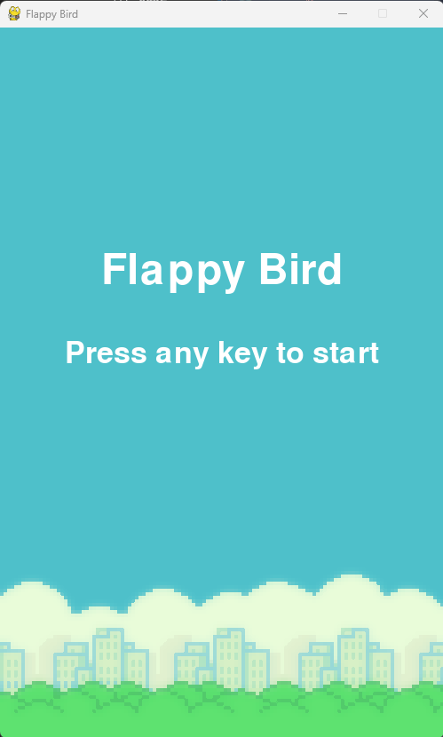
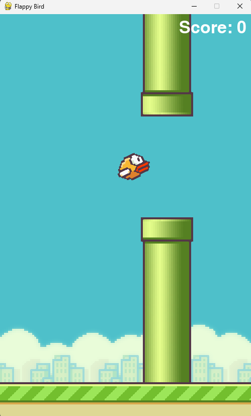
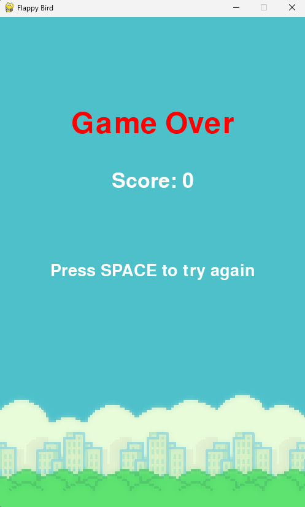

# Flappy Bird - Pygame Edition

A simplified clone of the classic Flappy Bird game built using **Python** and **Pygame**.  
Dodge the pipes, beat your high score, and have fun!  

---

## 🎮 How to Play

- Press **SPACE** to make the bird jump.  
- Avoid hitting the pipes or the ground.  
- Score points by passing through pipes.  
- After a game over, press **SPACE** to try again.  

---

## 🛠 Features

- Smooth bird animation with rotation.  
- Randomly generated pipes with collision detection.  
- Scrolling base and background for visual effect.  
- Score display and game over screen.  
- Sound effects for jumping, scoring, hitting, and game start.  

---


## 🚀 How to Run

1. Clone the repository:  
   ```bash
   git clone <your-repo-url>
   cd <repo-folder>
2. Make sure the imgs/ and audio/ folders are in the project directory.

3. Run the game:

    ```bash
    python main.py
## 🎨 Assets
- Bird, pipe, base, and background images are in imgs/.
- Sound effects are in audio/.

## 🙏 Credits
- Original Flappy Bird game: Dong Nguyen
- Pygame library: https://www.pygame.org

## 📸 Screenshots

Start Menu:  


Gameplay:  


Game Over Screen:  
